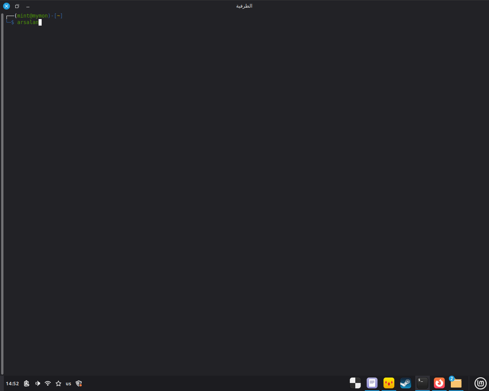
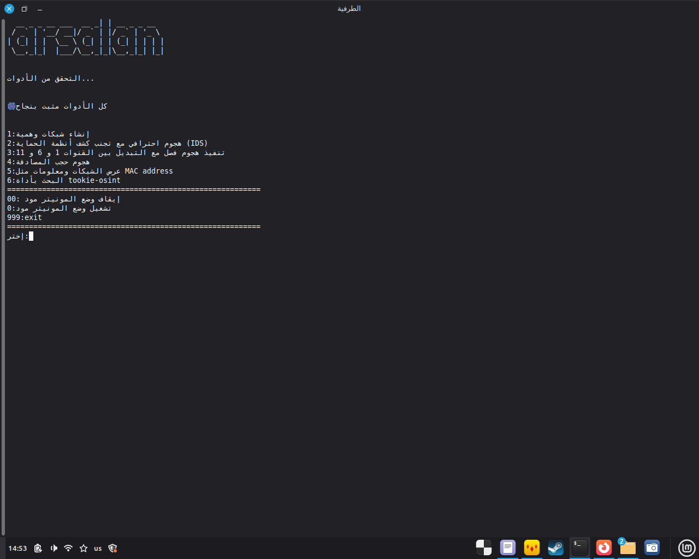

# 🛡️ Arsalan - أداة اختبار اختراق الشبكات اللاسلكية

**أداة متكاملة بوجهة عربية لاختبار اختراق الشبكات اللاسلكية وتجميع المعلومات**

---

## 📖 نبذة عن الأداة

**Arsalan** هي أداة متكاملة تجمع بين أقوى أدوات اختبار الاختراق في واجهة عربية سهلة الاستخدام. صممت خصيصاً لمختبرين الاختراق والباحثين في مجال أمن المعلومات.

---

## ✨ المميزات الرئيسية

| الميزة | الوصف |
|--------|--------|
| 🎯 **واجهة عربية** | واجهة مستخدم باللغة العربية بالكامل |
| 📡 **شبكات وهمية** | إنشاء شبكات WiFi وهمية لاختبار الأمان |
| 🛡️ **تجنب IDS** | هجمات احترافية مع تجنب أنظمة كشف التسلل |
| 📻 **هجوم الفصل** | Deauthentication Attack مع تبديل القنوات |
| 🚫 **حجب المصادقة** | Authentication Denial-Of-Service Attack |
| 🔍 **مسح الشبكات** | عرض الشبكات المتاحة مع معلومات MAC Address |
| 🕵️ **أداة OSINT** | بحث استخباراتي في وسائل التواصل الاجتماعي |

---

## 🖼️ لقطات من الأداة

### 🏠 القائمة الرئيسية

### ⚡ أثناء التنفيذ

---

## 🛠️ المتطلبات الأساسية
